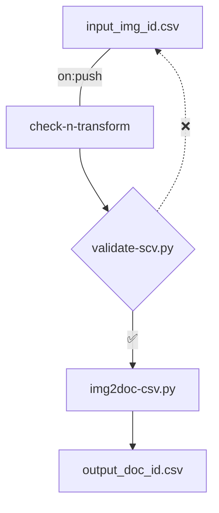
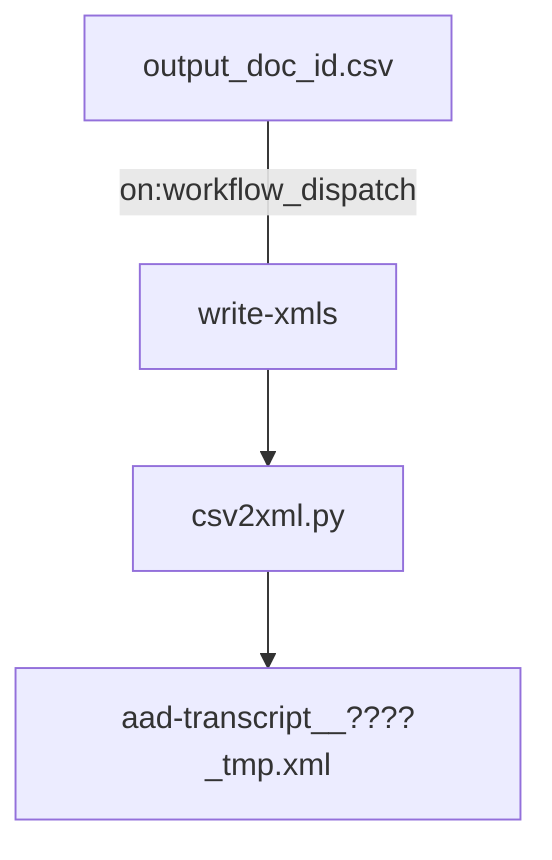

> [!NOTE]
> This repository is in development; all data are mock-up.

# aad-data

Repository for editorial data and data-creation workflows in the **Auden in Austria Digital** project.

- [aad-data Directory Structure](#aad-data-directory-structure)
- [aad-data Workflows](#aad-data-workflows)
  - [check-n-transform Workflow](#check-n-transform-workflow)
  - [write-xmls Workflow](#write-xmls-workflow)

## 1 aad-data Directory Structure

The [metadata/csv](https://github.com/auden-in-austria-digital/aad-data/tree/main/metadata/csv) directory contains the [input_img_id.csv](https://github.com/auden-in-austria-digital/aad-data/blob/main/metadata/csv/input_img_id.csv) input CSV file for basic (image-ID-centered) metadata creation as well as the automatically transformed (document-ID-centered) [output_doc_id.csv](https://github.com/auden-in-austria-digital/aad-data/blob/main/metadata/csv/output_doc_id.csv).

The [.github/workflows](https://github.com/auden-in-austria-digital/aad-data/tree/main/.github/workflows) directory holds the [check-n-transform](https://github.com/auden-in-austria-digital/aad-data/blob/main/.github/workflows/check-n-transform.yml) GitHub Action, which (`on: push`) runs [two scripts](https://github.com/auden-in-austria-digital/aad-data/tree/main/scripts/check-n-transform) (in the [scripts](https://github.com/auden-in-austria-digital/aad-data/tree/main/scripts) directory, [GNU General Public License v3.0](https://www.gnu.org/licenses/gpl-3.0.html#license-text)) to [validate](https://github.com/auden-in-austria-digital/aad-data/blob/main/scripts/check-n-transform/validate-csv.py) and [transform](https://github.com/auden-in-austria-digital/aad-data/blob/main/scripts/check-n-transform/img2doc-csv.py) the input CSV.

The [write-xmls](https://github.com/auden-in-austria-digital/aad-data/blob/main/.github/workflows/write-xmls.yml) GitHub-Actions workflow (`on: workflow_dispatch`) lets [another script](https://github.com/auden-in-austria-digital/aad-data/blob/main/scripts/write-xmls/csv2xml.py) read the [output_doc_id.csv](https://github.com/auden-in-austria-digital/aad-data/blob/main/metadata/csv/output_doc_id.csv) output CSV file and write template TEI/XML files (`aad-transcript__????_tmp.xml`) into the [data/xml/tmp](https://github.com/auden-in-austria-digital/aad-data/tree/main/data/xml/tmp) directory. From here, TEI/XML files are renamed (`aad-transcript__????.xml`) and moved to [data/xml/editions](https://github.com/auden-in-austria-digital/aad-data/tree/main/data/xml/editions) for editing.

> [!IMPORTANT]  
> The write-xmls workflow will overwrite unrenamed template TEI/XML files in the tmp directory.

## 2 aad-data Workflows
### 2.1 check-n-transform Workflow

### 2.2 write-xmls Workflow

