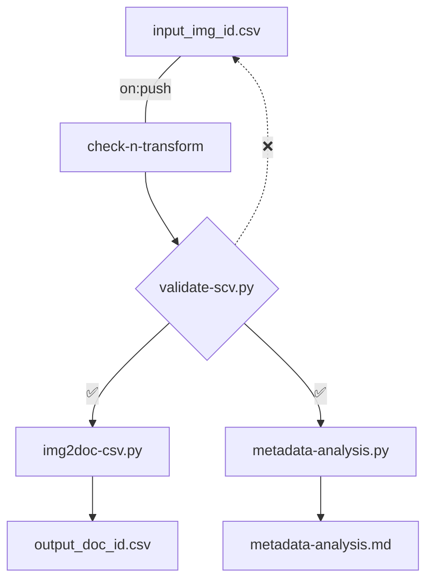
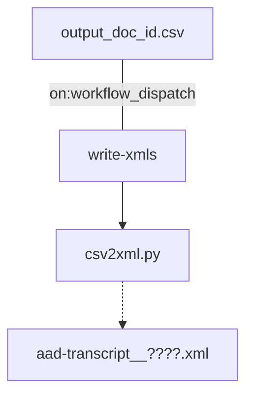

# aad-data

Repository for editorial data and data-creation workflows in the **Auden in Austria Digital** project.

- [aad-data Directory Structure](#1-aad-data-directory-structure)
- [aad-data Workflows](#2-aad-data-workflows)
  - [check-n-transform Workflow](#21-check-n-transform-workflow)
  - [write-xmls Workflow](#22-write-xmls-workflow)

## 1 aad-data Directory Structure

The [metadata/csv](metadata/csv) directory contains the [input_img_id.csv](metadata/csv/input_img_id.csv) input CSV file for basic (image-ID-centered) metadata creation as well as the automatically transformed (document-ID-centered) [output_doc_id.csv](metadata/csv/output_doc_id.csv). The [md](metadata/md) directory holds the [metadata-analysis.md](metadata/md/metadata-analysis.md) Markdown file, which reports key aspects of the metadata in summative fashion.

The [.github/workflows](.github/workflows) directory holds the [check-n-transform](.github/workflows/check-n-transform.yml) GitHub Action, which (`on: push`) runs [three scripts](scripts/check-n-transform) (in the [scripts](scripts) directory, hereby licensed [GNU General Public License v3.0](https://www.gnu.org/licenses/gpl-3.0.html#license-text)) to [validate](scripts/check-n-transform/validate-csv.py) and [transform](scripts/check-n-transform/img2doc-csv.py) the input CSV, and [write the Markdown report](scripts/check-n-transform/metadata-analysis.py).

The [write-xmls](.github/workflows/write-xmls.yml) GitHub-Actions workflow (`on: workflow_dispatch`) lets [another script](scripts/write-xmls/csv2xml.py) read the [output_doc_id.csv](metadata/csv/output_doc_id.csv) output CSV file and write template TEI/XML files (`aad-transcript__????_tmp.xml`) into the [data/xml/tmp](data/xml/tmp) directory. From here, TEI/XML files can be renamed (`aad-transcript__????.xml`) and moved to [data/xml/editions](data/xml/editions) for editing. The [data/xml](data/xml) directory furthermore holds the [aad-validation.sch Schematron schema](data/xml/aad-validation.sch) as a pre-ODD working tool against which TEI/XML files are validated.

> [!IMPORTANT]
> If working on the `dev` branch, run the write-xmls workflow from `dev` to avoid merge conflicts.

> [!WARNING]  
> The write-xmls workflow will overwrite unrenamed template TEI/XML files in the data/xml/tmp directory.

## 2 aad-data Workflows
### 2.1 check-n-transform Workflow

### 2.2 write-xmls Workflow

