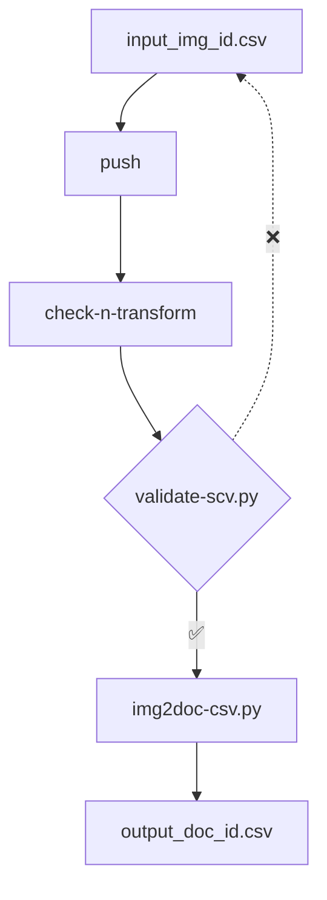

> [!NOTE]
> This repository is in development; all data are mock-up.

# aad-data

Repository for editorial data and data-creation workflows in the **Auden in Austria Digital** project.

## aad-data Directory Structure

The [metadata/csv](https://github.com/auden-in-austria-digital/aad-data/tree/main/metadata/csv) directory contains the [input_img_id.csv](https://github.com/auden-in-austria-digital/aad-data/blob/main/metadata/csv/input_img_id.csv) input CSV file for basic (image-ID-centered) metadata creation as well as automatically transformed (document-ID-centered) output formats.

The [.github/workflows](https://github.com/auden-in-austria-digital/aad-data/tree/main/.github/workflows) directory holds the [check-n-transform](https://github.com/auden-in-austria-digital/aad-data/blob/main/.github/workflows/check-n-transform.yml) GitHub Action, which runs scripts (in the [scripts](https://github.com/auden-in-austria-digital/aad-data/tree/main/scripts) directory, [GNU General Public License v3.0](https://www.gnu.org/licenses/gpl-3.0.html#license-text)) to [validate](https://github.com/auden-in-austria-digital/aad-data/blob/main/scripts/check-n-transform/validate-csv.py) and [transform](https://github.com/auden-in-austria-digital/aad-data/blob/main/scripts/check-n-transform/img2doc-csv.py) the input CSV.

## aad-data Workflows

### check-n-transform Workflow

### write-xmls Workflow